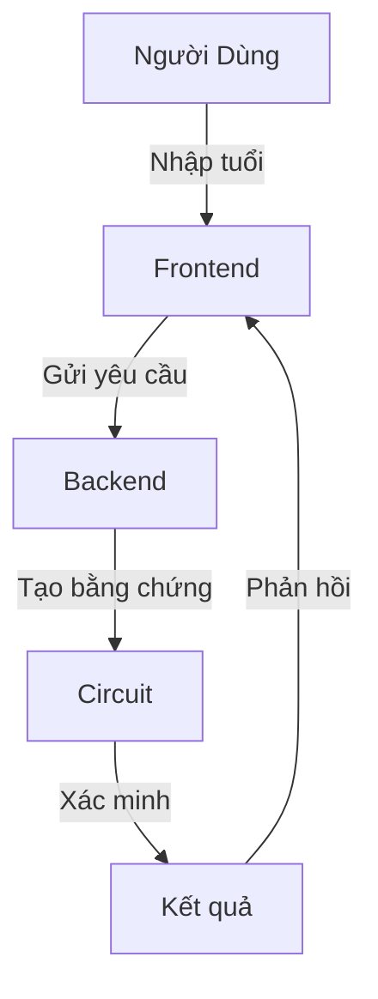

# Báo Cáo Hệ Thống Xác Minh Độ Tuổi Sử Dụng Zero-Knowledge Proof

### 1. Tổng Quan
- **Mục đích**: Xây dựng hệ thống xác minh độ tuổi bảo mật
- **Đặc điểm**: Không tiết lộ tuổi thật của người dùng
- **Công nghệ**: ZKP (Zero-Knowledge Proof)

### 2. Kiến Trúc Hệ Thống



### 3. Các Thành Phần Chính

#### 3.1. Circuit (Mạch Logic)
```circom


template AgeProof() {
    signal input age;       // Tuổi thật (private)
    signal input threshold; // Ngưỡng tuổi (public)
    signal input nonce;     // Số ngẫu nhiên
    signal output valid;    // Kết quả (1: hợp lệ, 0: không hợp lệ)
}
```
- **Chức năng**: Định nghĩa logic xác minh tuổi
- **Đầu vào**: 
  - age: tuổi người dùng (bí mật)
  - threshold: ngưỡng tuổi cần xác minh
  - nonce: số ngẫu nhiên tạo tính duy nhất
- **Đầu ra**: valid (1 nếu tuổi >= ngưỡng)

#### 3.2. Backend (Máy Chủ)
```javascript


app.post('/api/verify', async (req, res) => {
    // Nhận tuổi và ngưỡng
    // Tạo bằng chứng ZK
    // Xác minh bằng chứng
    // Trả về kết quả
});
```
- **Chức năng**: Xử lý yêu cầu và tạo bằng chứng
- **Quy trình**:
  1. Nhận thông tin từ người dùng
  2. Tạo bằng chứng ZK
  3. Xác minh bằng chứng
  4. Trả kết quả

#### 3.3. Frontend (Giao Diện)
```html


<!DOCTYPE html>
<html>
    <!-- Form nhập tuổi -->
    <!-- Hiển thị kết quả -->
</html>
```
- **Chức năng**: Giao diện người dùng
- **Tính năng**:
  - Nhập tuổi và ngưỡng
  - Hiển thị kết quả xác minh
  - Hiển thị thông báo lỗi

### 4. Quy Trình Hoạt Động

1. **Khởi Tạo**:
   - Biên dịch circuit
   - Tạo khóa chứng minh/xác minh
   - Thiết lập môi trường tin cậy

2. **Xác Minh Tuổi**:
   - Người dùng nhập tuổi
   - Hệ thống tạo bằng chứng
   - Xác minh bằng chứng
   - Trả về kết quả

3. **Ví Dụ**:
   ```text
   Input: Tuổi = 25, Ngưỡng = 18
   Output: "Age verification passed!"
   ```

### 5. Ưu Điểm

1. **Bảo Mật**:
   - Không tiết lộ tuổi thật
   - Bảo vệ thông tin cá nhân

2. **Tin Cậy**:
   - Kết quả được chứng minh toán học
   - Không thể giả mạo

3. **Minh Bạch**:
   - Có thể xác minh kết quả
   - Không cần tin tưởng hệ thống

### 6. Hướng Dẫn Sử Dụng

1. **Cài Đặt**:
```bash
git clone <repository>
cd ZKP
npm install
```

2. **Chạy Hệ Thống**:
```bash
./run.sh        # Khởi tạo circuit
cd webapp
node server.js  # Khởi động server
```

3. **Sử Dụng**:
   - Truy cập: http://localhost:3000
   - Nhập tuổi và ngưỡng
   - Nhận kết quả xác minh

### 7. Kết Luận

Hệ thống này minh họa cách áp dụng ZKP vào bài toán thực tế, cho phép xác minh độ tuổi mà không cần tiết lộ tuổi thật, đảm bảo quyền riêng tư cho người dùng.